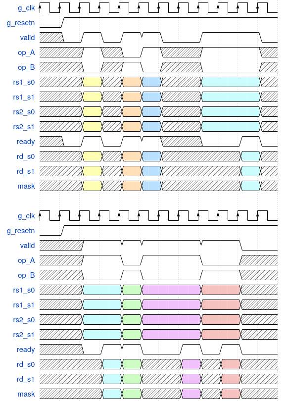

# Masking ISE Implementation

*Notes and information on the masking ISE implementation in the scarv-cpu.*

---

## Feature identification:

*How can I tell if the scarv-cpu has been simulated / synthesised / implemented
with the masking ISE?*

- Bit 13 of the `uxcrypto` CSR is *set* iff the Masking ISE is implemented.

- If the Masking ISE is not implemented, then bit 13 of `uxcrypto` is *clear*
  and attempting to execute a Masking ISE instruction will raise an
  `Illegal Opcode` exception.

## Source Files

The relevent source files for the masked alu are:

- `src/core/frv_masked_alu.v` - This contains the implementation of
  all masked instructions.

- `src/core/frv_pipeline_execute.v` - This contains an instance of
  the `frv_masked_alu` module, and is responsible for telling it
  what to compute and routing data to it.

As with all instructions, the decode and writeback modules also have
logic dedicated to routing data to/from the relevant ALU.

## Verification

### Unit Test

There is a single unit test which may be used for bringing up the
masked ALU instructions.

- See `verif/unit/masking-ise/` for the source files and how it is
  structured.

- The test can be run using:

  ```sh
  make run-unit-masking-ise
  ```

  This will place a waveform dump in `work/unit/masking-ise`.

- Also in the `work/unit/masking-ise` directory is a disassembly of the
  program, and GTKWave trace annotation files (`*.gtkwl`).

- This unit test is for sanity checking *only*. To verify the correctness
  of the design, use the model checkers.


### Model Checkers

There are formal model checkers for each masking ISE instruction in
`verif/xcfi/models/insn_mask*.v`.

- These can be run using:

  ```sh
  $> make xcfi-clean
  $> make xcfi-prepare
  $> sby -f work/xcfi/<instruction check name>.sby
  ```

  Which will place the results of the check, including any failure traces
  in: `work/xcfi/<instruction check_name>/`

- The failure trace (if any) will be in the `engine_0` directory.


## Decode Stage Operand Assignments

This section describes which decode to execute pipeline operand registers
hold which operands to the masked ISE instructions.

- `rsX.lo` refers to the *low*/*even* register in an odd/even register source
  pair.

- `rsX.hi` then refers to the *high*/*odd* register in that same pair.

Instruction     | Operand A | Operand B | Operand C | Operand D
----------------|-----------|-----------|-----------|------------
`mask_b2a`      | `rs1.lo`  |           | `rs1.hi`  |
`mask_a2b`      | `rs1.lo`  |           | `rs1.hi`  |
`mask_b_mask`   | `rs1`     |           |           |
`mask_b_unmask` | `rs1.lo`  | `rs1.hi`  |           |
`mask_b_remask` | `rs1.lo`  |           | `rs1.hi`  |
`mask_a_mask`   | `rs1`     |           |           |
`mask_a_unmask` | `rs1.lo`  | `rs1.hi`  |           |
`mask_a_remask` | `rs1.lo`  |           | `rs1.hi`  |
`mask_b_not`    | `rs1.lo`  | `rs2.lo`  | `rs1.hi`  | `rs2.hi`
`mask_b_and`    | `rs1.lo`  | `rs2.lo`  | `rs1.hi`  | `rs2.hi`
`mask_b_ior`    | `rs1.lo`  | `rs2.lo`  | `rs1.hi`  | `rs2.hi`
`mask_b_xor`    | `rs1.lo`  | `rs2.lo`  | `rs1.hi`  | `rs2.hi`
`mask_b_add`    | `rs1.lo`  | `rs2.lo`  | `rs1.hi`  | `rs2.hi`
`mask_b_sub`    | `rs1.lo`  | `rs2.lo`  | `rs1.hi`  | `rs2.hi`


## Example Masked ALU interface transactions



Wavedrom Source:

```
{ "signal" : [
  { "name": "g_clk",       "wave": "P..........." },
  { "name": "g_resetn",    "wave": "01.........." },
  { "name": "valid",       "wave": "x010110.1..0" },
  { "name": "op_A",        "wave": "xx1x01x.1..x" },
  { "name": "op_B",        "wave": "xx0x10x.0..x" },
  { "name": "rs1_s0",      "wave": "xx3x45x.6..x" },
  { "name": "rs1_s1",      "wave": "xx3x45x.6..x" },
  { "name": "rs2_s0",      "wave": "xx3x45x.6..x" },
  { "name": "rs2_s1",      "wave": "xx3x45x.6..x" },
  { "name": "ready",       "wave": "x01011x.0.10" },
  { "name": "rd_s0",       "wave": "xx3x45x...6x" },
  { "name": "rd_s1",       "wave": "xx3x45x...6x" },
  { "name": "mask",        "wave": "xx3x45x...6x" },
  {},
  { "name": "g_clk",       "wave": "P..........." },
  { "name": "g_resetn",    "wave": "01.........." },
  { "name": "valid",       "wave": "x.1.11..1.0." },
  { "name": "op_A",        "wave": "x.1.01..0.xx" },
  { "name": "op_B",        "wave": "x.0.10..1.xx" },
  { "name": "rs1_s0",      "wave": "x.6.78..9.xx" },
  { "name": "rs1_s1",      "wave": "x.6.78..9.xx" },
  { "name": "rs2_s0",      "wave": "x.6.78..9.xx" },
  { "name": "rs2_s1",      "wave": "x.6.78..9.xx" },
  { "name": "ready",       "wave": "x.0110.1010." },
  { "name": "rd_s0",       "wave": "x..67x.8x9xx" },
  { "name": "rd_s1",       "wave": "x..67x.8x9xx" },
  { "name": "mask",        "wave": "x..67x.8x9xx" },
],
  "config" : { "hscale" : 1 }
}

```
